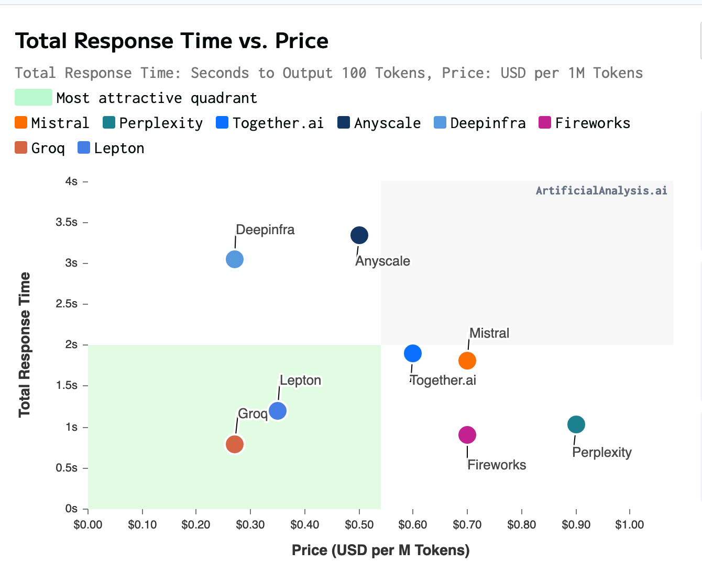
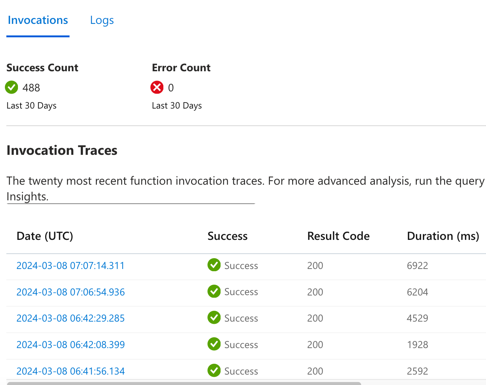
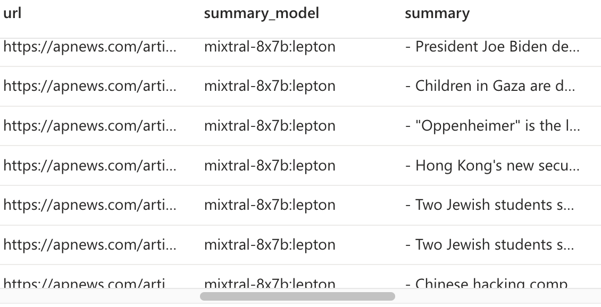

I've been working on a Telegram bot that summarizes articles in 5 bullet points.

Why?
- Ideal for breaking news, saving time compared to reading the entire article
- Helps you in deciding whether to read the full article
- Acts as a Table of Contents for longer articles to guide you as you read

Here's a video demonstration of the bot in action:



The bot works on articles of any length. For example, it can summarize [danluu's article on cocktail ideas](https://danluu.com/cocktail-ideas/), which is about 6.6k words, in a few seconds.



I primarily use this bot to summarize news articles, but it also works well for personal blog posts, technical articles, and opinion pieces.
# Summarization

For summarization, I use Mixtral, an open-source model that is cheaper and better than GPT3.5. I prompt Mixtral to produce a bullet point summary using a specific prompt that includes examples of good summaries. Here's an example of the prompt:

> Summarize the previous text in 5 bullet points. Each bullet point is a single sentence of around 30 words. Each sentence should be plain, at a 9th grade level. Include as many topics as possible, make every word count. Start every bullet point with a dash '-' and stop once you are done. Your bullet points should answer the 5W1H: 'Who', 'What', 'Where', 'When', 'Why' and 'How'. Example:
>  - Japanese Yakuza leader accused of involvement in trafficking nuclear materials
>  - Small plane carrying two people lands safely after door falls off midflight over Stiglmeier Park in Cheektowaga, New York.
>  - Google apologizes after new Gemini AI refuses to show pictures, achievements of White people

Mixtral is hosted by several providers, so I recommend shopping around to find the best one for your needs. I use Lepton as my API provider because it offers quick response times for low prices, but I'm considering switching to Groq, which uses custom chips instead of GPUs to serve Mixtral.

For my bot, I pay approximately $1.50/mo to Lepton for their API for a thousand articles. That's with one user. On average each article has about 2750 tokens of input and 250 tokens of output.

Here's a chart showing the response time vs price for various providers, from [artificialanalysis](https://artificialanalysis.ai/models/mixtral-8x7b-instruct/hosts?parallel_queries=single&prompt_length=long). The chart isn't that accurate: Lepton is charging me $0.5 / M tokens, not $0.35. But still, Lepton has been pretty good in the time I've used it.



*Chart was taken on Feb 29*

### Other models

With the new Claude Haiku and Mistral 8x22b models out, I would strongly consider moving to those instead. 
- Haiku is $0.25/1.25, which is already cheaper than Lepton
- Mistral 8x22b is going for $1.08/1.08, which is pretty expensive, but it's one of the best models out there. I'd wait for it to get fine tuned with a good Nous-Hermes or Nous-Capybara finetune, though.
## Summarizing longer articles

Mixtral has a large context length of approximately 25k words or 32k tokens, but it produces better summaries when fed shorter articles. To summarize longer articles, I use a chunking strategy where I chop the text into pieces, summarize each piece into one paragraph, then summarize the paragraphs. This results in a more comprehensive summary that covers more broad points about the article.

For example, here's a comparison of two summaries of [danluu's article on diseconomies of scale](https://danluu.com/diseconomies-scale/):

**Summary 1 (long context)**
> - Facebook allowed a large-scale pedophilic community to thrive on Instagram, with its recommendation systems recommending accounts with underage sex content.
> - Instagram's search bar suggested terms associated with child sexual exploitation, and even glancing contact with accounts with names like Incest Toddlers was enough to trigger Instagram to begin pushing users to connect with them.
> - The company was aware of the problem but failed to take significant action, with the head of Indian Public Policy blocking efforts to designate certain accounts as hate figures.
> - The company's leadership, including CEO Mark Zuckerberg, downplayed the issue, stating that Facebook wasn't driving societies into contexts where they can't trust each other.
> - Researchers within Facebook found that Instagram was making body image issues worse for one in three teen girls, with only 1% of users reporting objectionable content and Instagram taking action in 2% of those cases.

**Summary 2 (chunked)**
> - Larger tech companies like Google have higher rates of scams, spam, and fraudulent content in their search results, with worse support and lower chances of reinstatement after bans.
> - Smaller companies like Craigslist often have better moderation and spam filtering due to hands-on approaches, while larger companies rely on algorithms that can be gamed.
> - Facebook is under fire for its flawed user banning process, with 10% of the author's acquaintances getting banned incorrectly, due to lack of systematic effort to track or decrease false positives.
> - Economies of scale don't always mean better results for larger companies, as seen in Amazon's scams and counterfeit items, and Facebook's failure to combat misinformation and extremism.
> - Theoretical arguments about diseconomies of scale often don't hold up in reality, and it's important to look beyond

I implemented a very basic chunking strategy to summarize long articles of over 3000 words. I chop the text into pieces, summarize each piece into one paragraph, then summarize the paragraphs. There are 7 sections in total that got summarized into 7 paragraphs, and the bullet point summary gets made summarizing those paragraphs. Here's the first chunked summary paragraph of Daniel's article that covers the first section of his essay. 

> The article discusses how larger tech platforms, like Google, have more resources but also a higher rate of scams, spam, and fraudulent content. It mentions that support becomes worse as the platform size increases, and account reinstatement becomes less likely in the event of an incorrect suspension or ban. The author argues that many things get worse as platforms get bigger, and provides examples of Twitter polls and comparisons to Americans' beliefs about vaccines and the moon landing. Zuckerberg's claim that breaking up big tech companies would make content moderation issues worse is also mentioned, along with the argument that economies of scale work well for moderation and spam filtering. However, the article provides examples of smaller companies having better results in moderation and spam filtering than larger ones. The author encourages looking at what gets better and worse as companies become larger, rather than assuming that everything will get better with scale.

While there is no shortage of complicated algorithms out there offering complex semantic chunking, I found that the naive method of just splitting the text into evenly-sized chunks at line breaks was good enough. If you're interested, I have links in the references to more complex algorithms that do things like topic segmentation and topic modeling.

# How useful is summarization?

While summarization can be useful for quickly understanding the main points of an article, I found that it wasn't always what I wanted. What I really want is something that allows me to transfer knowledge into my brain faster. Summaries aren't information dense enough for that, and if the article is well written, there isn't much else you can do to just read it.

That said, summaries can be useful for articles that contain a lot of fluff or for answering specific questions that are buried in a textbook. 
Summaries are good for the case of fluff since they cut through fluff amazingly. But for Q&A, using ChatGPT Plus or Copilot Pro would probably be a lot better, since you can just upload a PDF file there and ask questions about it.

*tldr* - Summarization is like JPEG for ideas, and if you want a png, you'll be disappointed.
## Disagreeing
One interesting feature of the bot is that it can also disagree with articles, which can help you think critically about what you're reading. Here's an example of Mixtral disagreeing with [danluu's article on people mattering](https://danluu.com/people-matter/):

> In response to the opinion piece, I believe that there is a balance to be struck between simplifying complex systems and harnessing the unique strengths of individuals. While it's true that treating individuals as fungible can make a system more legible and scalable, it may also result in inefficiencies and the loss of potential outlier returns. However, ignoring the importance of team dynamics and institutional knowledge can lead to disastrous consequences, as seen in examples of entire teams being disbanded and sub-products falling into disrepair. On the other hand, promoting individuals based solely on the number of people they manage can discourage innovation and lead to bureaucratic, unproductive environments. The sweet spot lies in acknowledging and leveraging the unique skills and experiences of each individual, while maintaining a clear, scalable system. By doing so, companies can reap the benefits of both efficiency and creativity.

As you can see, the bot's disagreements are still a work in progress and don't always address the main points of the article, but they can be a useful starting point for thinking critically about what you're reading.

The problem is that summarization is an in-context task, where all the info that an LLM needs to summarize is already present in the prompt. The AI doesn't have to invent anything new or be creative, and so a fairly dumb AI model would work. Mixtral is actually overkill for summarizing news articles. In my own experiments, I found that quantized 3b models work well enough for the majority of news articles. For reference, Mixtral is about 25x bigger than these models.

Disagreeing is a creative process. It requires the AI to think and invent new ideas by itself. So you want the smartest AI model on the planet to disagree with you. Exactly like having a yes-man vs a guy who gives you constructive criticism.

I'm trying out different techniques and will post about it once I'm done with research, but from initial thoughts it will either be GPT4-Turbo or Claude 3 Opus.

The problem is that these models are incredibly expensive. Claude 3 Opus would cost ~$0.06 per disagreement, 50x more expensive than Mixtral. Even if you only generate 10 disagreements a day, that's $18 / mo in api costs! 💰💰 Which is why I'm working to see if I can get better results from cheaper models.

# Telegram API
Working with the telegram API was surprisingly easy and I don't have much to say here. The examples on the python-telegram-bot repo are way more helpful than the documentation. For more info, I'd recommend reading the file `bot_handlers.py` in [my repo](https://github.com/thomastay/url-summarizer-telegram-bot).

# Fetching and parsing articles
I used [trafilatura](https://trafilatura.readthedocs.io/en/latest/), which is an open source library for parsing HTML. BeautifulSoup is great when you know the structure of your document, but trafilatura is tuned for extracting articles from text.
Not much to say here, just use `trafilatura.extract_text`. 

As I read a lot of blog posts with code samples, which you don't need for summarization, I setup trafilatura to filter out `<code>`, `<pre>` and `<table>` blocks, which you can do with the following snippet.
```python
trafilatura.extract(
	downloaded,
	prune_xpath=["//code", "//pre"],
	include_tables=False,
)
```

I feel like there's so much more that I want to do here. IMO the biggest issue about an article summarizer is getting quality articles out of the HTML. I intend to write custom parsers for common domains as my next project, and hopefully improve the quality of article extraction for news articles at least.
# Infrastructure
*Disclaimer*: this was an experimental project so I decided to use infrastructure that I'm not typically accustomed to. I would not recommend this stack - instead, just use Supabase!

I currently host my summary bot on Azure Functions, which is a great option as it offers a free tier. You receive 1M free function executions per month, which is more than sufficient for a single-user bot. Running the bot as a function provides some nifty features, such as auto-monitoring and tracing.


I then deploy the app to Azure from a Github action which runs on every push.

The primary issue with running a chatbot on functions is the cold starts, which can result in a wait of up to 7 seconds if the bot hasn't been used in the past 5 minutes. This is insanely annoying for a 1:1 chatbot since you basically have to send a message and just stare at the screen forever until you get a reply.

Another annoyance I had with Azure functions is that if your *requirements.txt* file doesn't contain all the necessary packages, your deployment will just fail with absolutely no warnings. The sort of thing that makes you pull your hair out debugging.

Also, in order to setup a HTTP triggered Azure function, your function name has to contain "http" in it. The Azure docs contain absolutely **no** references to this, and you only figure this out after reading mountains of stackoverflow posts.

Due to these reasons, I'm considering moving to hosting my own server soon on an Azure VM. I've considered Platform as a Service (PaaS) services, but they seem to require more effort than simply hosting a bot on a VM directly. I'm curious to know why people use PaaS, so feel free to share your thoughts.

*Disclosure: I work for Microsoft*

## Database
I use Azure blob & table storage as my database :)

I have a table that stores summaries along with the user ID of the person who generated them. It's keyed on the timestamp of the summary creation and is primarily used for me to review bad summaries and figure out how to improve things.


I have a *users* table that's just me and my friends. When a user sends a message to the summary bot, it first checks to see if the user ID is present in the users table as a form of authentication.
Invites are sent via invite codes, which I send over DMs on Telegram. Telegram has a feature that allows for the sending of deeplinks to a bot, which I use to trigger the _start_ command on my bot. If the invite code is valid, then I add them to the users table.
Again, I wouldn't recommend this setup. Use Supabase or even just sqlite to get proper auth / database integration. However, this process is incredibly cost-effective. Blob storage is so cheap that it doesn't even register as a cost on my bill. If you use the cloud sparingly, it can result in significant cost savings.

# Conclusion
Overall, this was a fun and enlightening project to work on. I dedicated about a month to it on weekends, focusing mainly on improving the prompts. The DB + Telegram side was relatively quick to work on, and I essentially hacked it together in a weekend.
If you're interested in checking out the code, the repository is open source and can be found here: [URL Summarizer Telegram Bot](https://github.com/thomastay/url-summarizer-telegram-bot)
If you'd like to know more, feel free to @ me on Twitter [@thomastayac](https://twitter.com/thomastayac), or send me an email at [thomastayac@gmail.com](mailto:thomastayc@gmail.com). Sorry but I can't open up access for now, the API cost is too expensive to open it up for public use, and I don't feel it's in any state to charge people for it.

# References
1. https://openai.com/research/summarizing-books. This article was my inspiration for the chunking strategy
2. Lost in the Middle: How Language Models Use Long Contexts. https://arxiv.org/abs/2307.03172. This paper explains why LLMs are poor at summarizing articles from long contexts. More advanced LLMs like Gemini 1.5 have supposedly solved this problem, though they didn't say how.
3. https://artistdetective.wordpress.com/2017/12/02/how-to-summarize-the-internet/
4. https://pashpashpash.substack.com/p/tackling-the-challenge-of-document
5. https://towardsdatascience.com/summarize-podcast-transcripts-and-long-texts-better-with-nlp-and-ai-e04c89d3b2cb
6. https://github.com/FullStackRetrieval-com/RetrievalTutorials/blob/main/5_Levels_Of_Text_Splitting.ipynb
